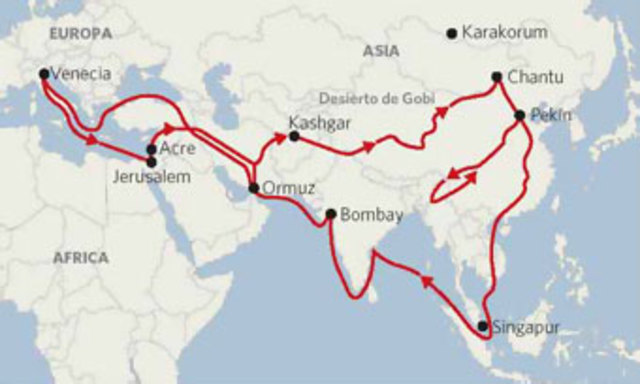

# Составление карты путешествия Марко Поло
# (нач. 1271 г.)

### В 1271 Маттео и Никколо Поло вместе с Марко отправились из Венеции в Иерусалим.  
### Морским путём добрались до юго-восточного побережья Малой Азии и далее по суше проехали через  
### Армянское нагорье, Месопотамию, Иранское нагорье, Памир и Кашгарию, и достигли Китая.
---
*С самого момента его возвращения в город истории из поездки воспринимались с недоверием*

*В свою очередь, в 1995 году Франсис Вуд, куратор китайской коллекции Британского Музея,*
*выпустила книгу «Был ли Марко Поло в Китае?», в которой поставила под вопрос сам факт*
*путешествия Поло в Китай, предположив, что венецианец не путешествовал за пределы Малой Азии*
*и Чёрного моря, а просто использовал известные ему описания путешествий персидских купцов.*
---
Маршрут в формате json находится в файле pathPoints,  
а также его можно посмотреть на ресурсах:  
* [здеся](http://geojson.io/#id=gist:EllaLoe/68a45fc6af65d7951aba20647f5808e5&map=3/25.88/64.51)
* [тута](https://gist.github.com/EllaLoe/68a45fc6af65d7951aba20647f5808e5)

Маршрут составлен по изображению:  
